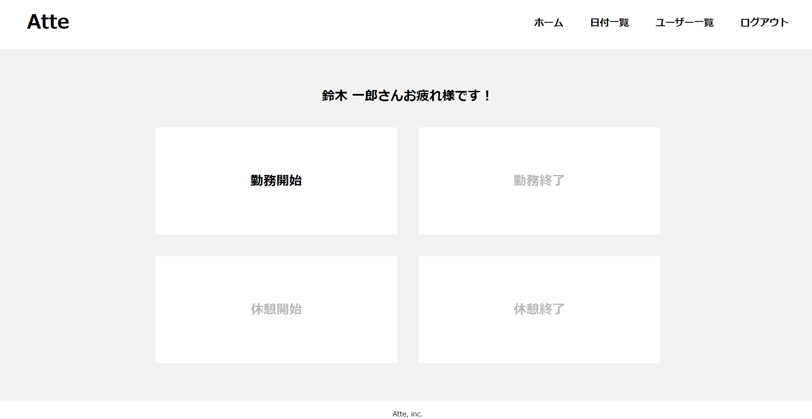

# Atte(勤怠管理システム)


## 作成した目的
人事評価のため

## URL
- 開発環境: 'http://localhost/'
- phpMyAdmin: 'http://localhost:8080/'
- mailhog: 'http://localhost:8025'
- 本番環境: 'http://52.196.224.73'

## 機能一覧
- 会員登録
- ログイン
- 勤怠・休憩打刻
- 日付別勤怠管理
- ユーザー別勤怠管理
  ※勤務終了未打刻の勤怠情報は表示されない

## 使用技術(実行環境)
- PHP 8.3.0
- Laravel 8.83.27
- MYSQL 8.0.26

## テーブル設計


## ER図


## 環境構築
**Dockerビルド**
1. 'git clone git@github.com:tyswtpooh55/atte.git'
2. DockerDesktopアプリを立ち上げる
3. 'docker-compose up -d --build'

**Laravel環境構築**
1. `docker-compose exec php bash`
2. `composer install`
3. [.env.example]ファイルを[.env]ファイルに命名変更
4. .env に以下の環境変数を追加
  ```
  APP_NAME=Atte

  DB_CONNECTION=mysql
  DB_HOST=mysql
  DB_PORT=3306
  DB_DATABASE=laravel_db
  DB_USERNAME=laravel_user
  DB_PASSWORD=laravel_pass
  ```
5. アプリケーションキーの作成
  `php artisan key:generate`
6. マイグレーションの実行
  `php artisan migrate`

>[!NOTE]
>開発環境下でのメール送信テストを行う場合
>1. Dockerビルド`3.docker-compose up -d --build`実行前に、docker-compose.yml内の `mailhog`以下5行のコメントアウト(#)を削除
>2. Laravel環境構築`4. .env 環境変数追加`で
>`MAIL_FROM_ADDRESS=noreply@example.com`
>localhost:8080 にて認証メール受信の確認

## 本番環境利用時
- 会員登録済アカウント
  - 氏名: 鈴木一郎
  - メールアドレス: wtp_55_tmym@yahoo.ne.jp
  - パスワード: abcd1234
- 新規会員登録の場合、`wtp_55_tmym@yahoo.ne.jp`からのメール受信あり。メールアドレス認証後、ログイン可能